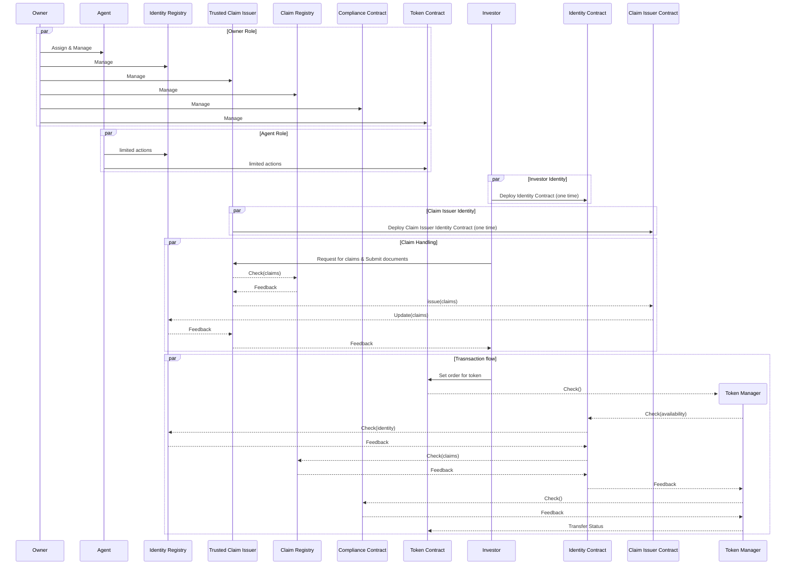

# BLU-Nicaragua

## Stakeholders
Owners, Agents , Investors , claim issuers 

* Owners: The Owner Role is responsible for the core management of contracts, it is an administrator role with the capacity to modify the contracts settings as well as the rules of compliance, the Owner is also responsible to delegate permissions to Agent wallets by assigning the Agent Role to them.

* Agents: The Agent Role is responsible for the operational management of contracts, Agents are able to perform all operational tasks such as minting tokens, burning tokens, whitelisting investors, etc

* Investors: The Investor Role will only be able to make a purchase order for the token, request claims and deploy its identity contract in this eco system.

* Claim issuers: The Claim issuers (could be a third party or multiple third parties or it could be an internal sector or it could be all of it based on the claim) will verify the ONCHAIN IDENTITY of the parties involved. They will issue claims for the wallet addresses and based on the list of claims a wallet address has the clearance level could be managed.

## Contracts Involved

Water Token, Identity Registry, Identity Registry Storage, Claim Topic Registry , Claim Issuer Registry, Modular Compliance

* Water Token: Basically developed based on ERC20 and involves ERC3643 standards. It includes all the functionalities of ERC20 token and it acts according to the ERC3643 standard.

* Identity Registry: This contract manages the identities of the token holders. It ensures that only eligible investors can hold tokens by validating their identities and credentials through signed attestations issued by trusted claim issuers.

* Identity Registry Storage: This contract stores the identity information that the Identity Registry interface uses to validate identities. It also manages the bounding of the claims ( it is not necessary for a wallet address to expose all the claims it has while requesting for a ONCHAINID check)

* Claim Topic Registry: This contract involves the set of claims associated with any action in the ecosystem. It also includes all the functions to manage claims.

* Claim Issuer Registry: This contract involves the third parties and internal bodies that can issue claims. This also includes all the functions to manage claim issuers.

* Modular Compliance: This contract involves the set of things that has to be checked before a transfer is made. All restrictions, fees, limits and time constraints will be included in this contract.

## Role in detail

### Owner

| Type of function |  Functions |
| ---------------- | ---------------- |
| Token Information Management    | setName, setSymbol, setOnchainID |
| Registries Settings             | setClaimTopicsRegistry, setTrustedIssuersRegistry, setIdentityRegistry, setIdentityRegistryStorage |
| Compliance Settings             | setCompliance |
| Compliance Management           | bindToken, addModule, removeModule |
| Claim Registry Management       | addClaim, removeClaim |
| Issuers Registry Management     | addTrustedIssuer, removeTrustedIssuer, updateIssuerClaims |
| Roles Management                | transferOwnership, addAgent, removeAgent |

### Agent

| Type of function |  Functions |
| ---------------- | ---------------- |
| Supply modification   | Mint, burn, batchMint, batchBurn |
| Transfer restrictions   | Pause, unPause, setAddressFrozen, batchSetAddressFrozen, freezePartialTokens, unfreezePartialTokens, batchFreezePartialTokens, batchUnfreezePartialTokens |
| Transaction             | forcedTransfer, batchForcedtransfer |
| Token recovery           |recoveryAddress |
| Whitelisting      | registerIdentity, updateIdentity, updateCountry, deleteIdentity |

## The Design

