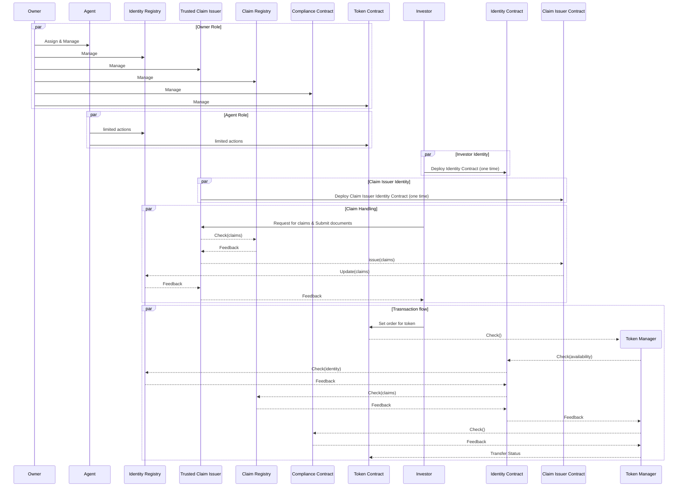

# BLU-Nicaragua

```mermaid
sequenceDiagram

    par Owner Role
    Owner ->> Agent : Assign & Manage
    Owner ->> Identity Registry : Manage
    Owner ->> Trusted Claim Issuer : Manage
    Owner ->> Claim Registry : Manage
    Owner ->> Compliance Contract : Manage
    Owner ->> Token Contract : Manage
    end

    par Agent Role
    Agent ->> Identity Registry : limited actions
    Agent ->> Token Contract : limited actions
    
    end
    
    par Investor Identity
    Investor->>Identity Contract: Deploy Identity Contract (one time)
    end

    par Claim Issuer Identity
    Trusted Claim Issuer->>Claim Issuer Contract: Deploy Claim Issuer Identity Contract (one time)
    end

    par Claim Handling
    Investor->>Trusted Claim Issuer: Request for claims & Submit documents
    Trusted Claim Issuer -->> Claim Registry : Check(claims)
    Claim Registry-->> Trusted Claim Issuer : Feedback
    Trusted Claim Issuer -->> Claim Issuer Contract: issue(claims)
    Claim Issuer Contract -->> Identity Registry : Update(claims)
    Identity Registry-->> Trusted Claim Issuer : Feedback
    Trusted Claim Issuer -->> Investor : Feedback
    end

    par Trasnsaction flow
    Investor->>Token Contract: Set order for token
        create participant Token Manager
        Token Contract-->>Token Manager: Check()
        Token Manager-->>Identity Contract: Check(availability)
        Identity Contract -->> Identity Registry: Check(identity)
        Identity Registry -->> Identity Contract: Feedback
        Identity Contract -->> Claim Registry: Check(claims)
        Claim Registry -->> Identity Contract: Feedback
        Identity Contract -->> Token Manager : Feedback
        Token Manager -->> Compliance Contract : Check()
        Compliance Contract -->> Token Manager : Feedback
        Token Manager -->> Token Contract: Transfer Status
    
    end

```
